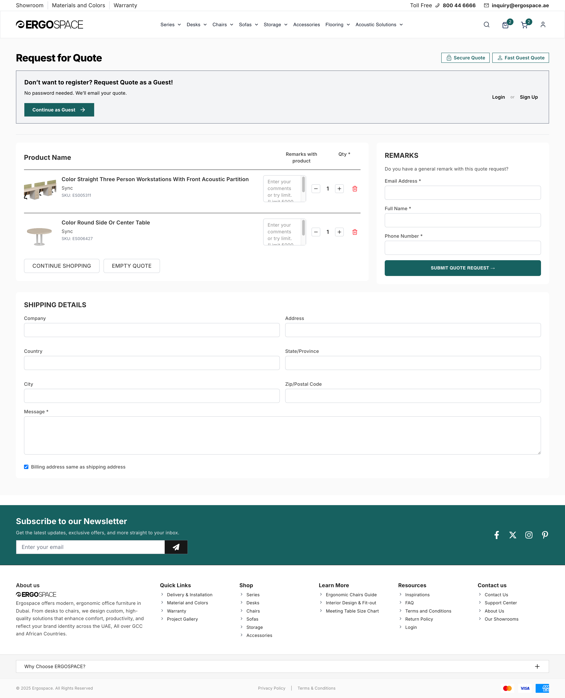
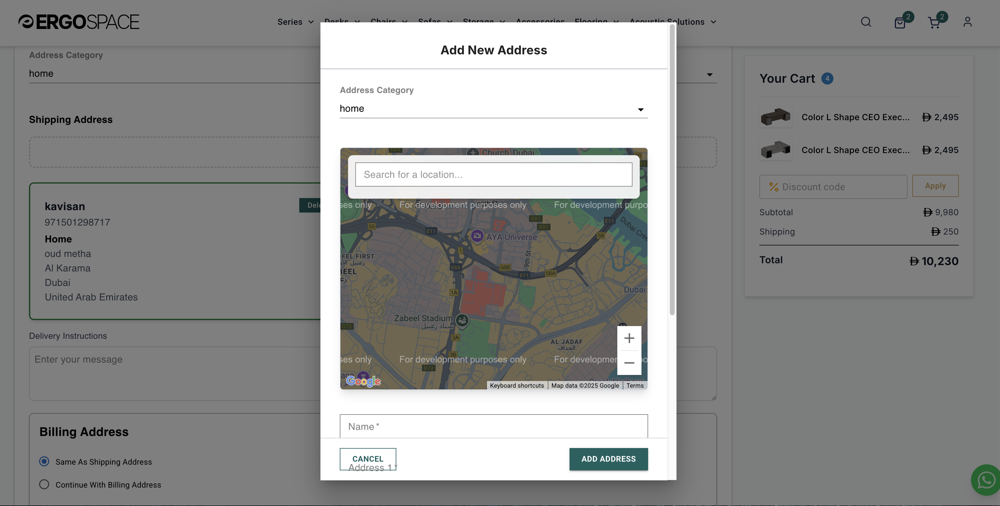
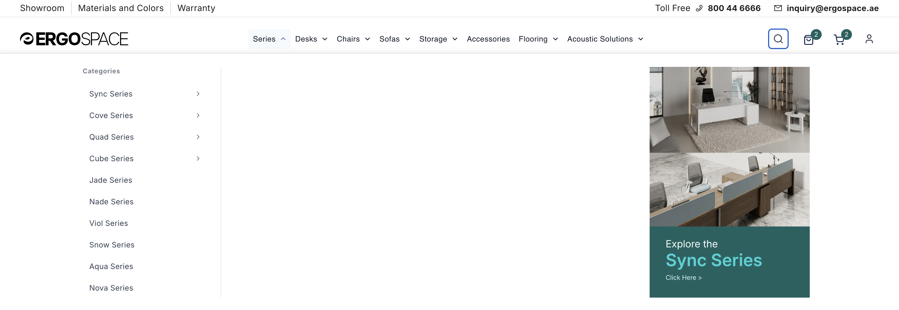
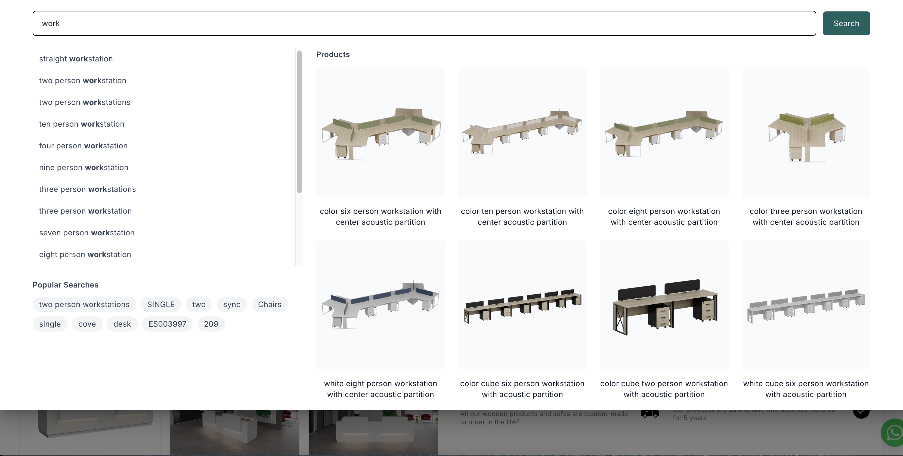

# Ergospace: B2B E-Commerce Agile Transformation

**Role:** Product Manager & Agile Owner
**Scale:** 30,000 SKUs | 5M AED/Month Revenue
**Tech Stack:** Next.js, Node.js, Python, Google Maps API, Shopify Liquid

## Project Summary
This repository documents the complete digital overhaul of the Ergospace B2B marketplace. I led the migration from a legacy manual interface to a high-performance, conversion-optimized platform. The focus was on automating inventory flows for 30,000+ SKUs and creating specific B2B procurement features to reduce sales friction.

---

## 1. B2B Checkout & Procurement Engine

**Problem:** Corporate buyers were abandoning the funnel due to forced account registration and unclear delivery logistics.

**Solution:** Architected a "Guest Quote" workflow and integrated location intelligence.

**Feature: Guest Quote System**
Designed a friction-free "Add to Quote" engine allowing corporate buyers to generate Proforma Invoices without login.

**Feature: Logistics Intelligence**
Integrated Google Maps Javascript API for precise pin-drop delivery to solve last-mile address issues in the UAE.

* **Documentation:** [View Product Requirements Document (PRD)](/docs/PRD_UX_Overhaul.md)

---

## 2. Complex Data Architecture & CRO

**Problem:** High bounce rate on Product Listing Pages (PLP) due to lack of technical information (variants, materials) at a glance.

**Solution:** Engineered a "Smart Product Tile" component to display deep metadata upfront.

**Feature: Smart Product Tile**
Created a JSON schema to pass variant depth (e.g., "Available in 18 Materials") and Brand Collection logos dynamically to the card.

* **Documentation:** [View Product Tile Schema](/architecture/smart-product-tile.json)

---

## 3. UX Strategy & Navigation

**Problem:** Users struggled to discover products across the 30,000 SKU catalog spanning multiple sub-brands (Sync, Cove, Quad).

**Solution:** Implemented a visual Mega Menu and predictive search logic.

**Feature: Visual Mega Menu**
Organized the catalog into visual categories with promotional slots for sub-brands.

**Feature: Predictive Search**
Search logic that exposes product variants and categories instantly.

---

## 4. Performance Engineering & Automation

**Problem:** High latency and slow page loads due to unoptimized legacy image formats across a massive catalog.

**Solution:** Implemented server-side optimization scripts.

* **Automation:** Wrote and deployed a Shell/Python script to recursively find and mass-convert catalog assets to WebP format.
* **Impact:** Reduced average page load size by approximately 60%, significantly boosting Core Web Vitals and SEO rankings.
* **Documentation:** [View Optimization Script](/scripts/optimize_images.sh)

---

## 5. Agile Leadership & Sprint Planning

**Role:** Scrum Master & Product Owner
**Process:** Transitioned the team from ad-hoc waterfall tasks to structured 2-week sprints using Jira.

* **Sprint 15 Velocity:** Managed a high-velocity sprint focusing on the "Add to Quote" drawer integration and payment gateway APIs.
* **Backlog Management:** Responsible for grooming user stories, defining acceptance criteria, and managing blockers for a cross-functional team (Frontend, Backend, QA).
* **Documentation:** [View Sprint 15 Backlog Export](/project-management/sprint_15_backlog.md)

---

## Repository Structure

* **architecture/** - JSON schemas defining the data models for search, product cards, and inventory.
* **docs/** - Product Requirement Documents (PRDs), Design Systems, and Technical Specifications.
* **project-management/** - Exports of Jira backlogs, sprint plans, and burndown summaries.
* **scripts/** - Utility scripts used for data migration and performance optimization.
* **ergospace-ai-mockup-generator/** - A new project used for generating product mockups from product datasheets.

---

## Disclaimer
This repository contains documentation, schemas, and utility scripts to demonstrate Product Architecture and Technical Strategy. Proprietary source code and client data have been excluded for confidentiality.
